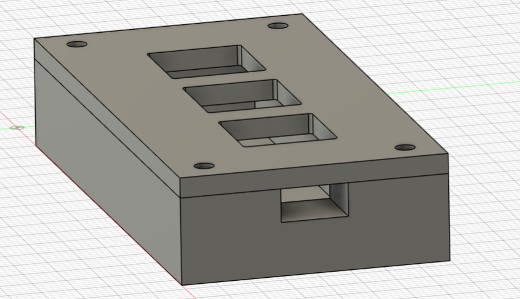
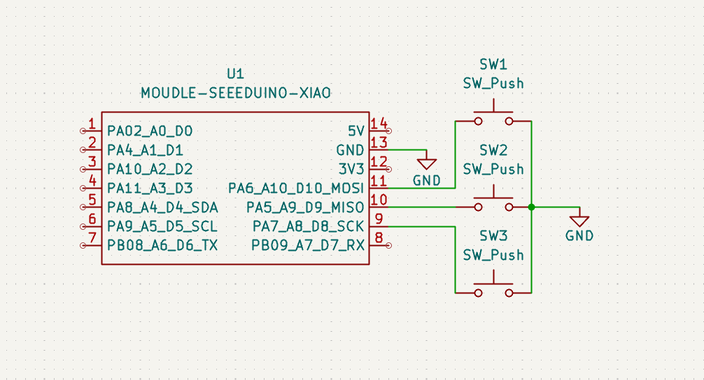
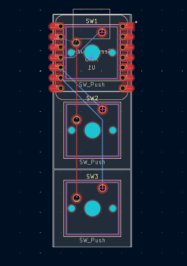

# Stevenpad

Stevenpad is a simple 3-key macropad using a Seeed Studio XIAO RP2040 as the main microcontroller. It uses three Cherry MX compatible switches and a custom PCB designed in KiCad.

This project is meant to be a compact and beginner-friendly hackpad, focused on the essential parts of a macropad: keys, PCB, firmware, and a case.

## Features

- 3 mechanical keys
- Seeed Studio XIAO RP2040 microcontroller
- Cherry MX compatible switches
- Custom PCB designed in KiCad
- Compact 3-key layout
- Simple firmware for shortcuts and macros
- 3D printed case

## CAD Model

The case is designed to hold the PCB and the three switches in a compact layout. The Seeed Studio XIAO RP2040 is mounted on the PCB, while the switches are placed on top for easy access.

The case is made from 3D printed parts and is designed to keep the hackpad small and clean.



## PCB

Here is my PCB! It was made in KiCad.

The PCB uses a simple 2-layer design and connects the three switches directly to the Seeed Studio XIAO RP2040. Each switch is connected to a GPIO pin and GND.

The board is smaller than 100mm x 100mm, following the hackpad requirements.

### Schematic



### PCB



I used Cherry MX compatible switch footprints for the keyswitches and a through-hole XIAO RP2040 footprint for the microcontroller.

The switches are connected as follows:

| Switch | XIAO Pin | GPIO |
|---|---|---|
| SW1 | D10 / MOSI | GP3 |
| SW2 | D9 / MISO | GP4 |
| SW3 | D8 / SCK | GP2 |

## Firmware Overview

This hackpad uses QMK firmware.

The firmware uses a direct pin matrix because each switch is connected directly to one GPIO pin and GND.

Current keymap:

| Key | Action |
|---|---|
| SW1 | A |
| SW2 | B |
| SW3 | C |

These keys can be changed later to shortcuts or macros such as copy, paste, enter, media controls, or app shortcuts.

The firmware source files are included in the `Firmware` folder.

## BOM

Here should be everything you need to make this hackpad:

| Part | Quantity | Notes |
|---|---:|---|
| Seeed Studio XIAO RP2040 | 1 | Main microcontroller |
| Cherry MX compatible switches | 3 | Mechanical keyboard switches |
| 1u keycaps | 3 | Keycaps for the switches |
| Custom PCB | 1 | Designed in KiCad |
| 3D printed case | 1 | Custom case |

## Production Files

The production files are included in the `production` folder.

This folder contains:

- `gerbers.zip` for PCB manufacturing
- case files for 3D printing
- `firmware.uf2` for flashing the XIAO RP2040

## Project Structure

```text
Stevenpad/
├── CAD/
├── PCB/
├── Firmware/
├── production/
├── images/
│   ├── cad.png
│   ├── schematic.png
│   └── pcb.png
└── README.md
